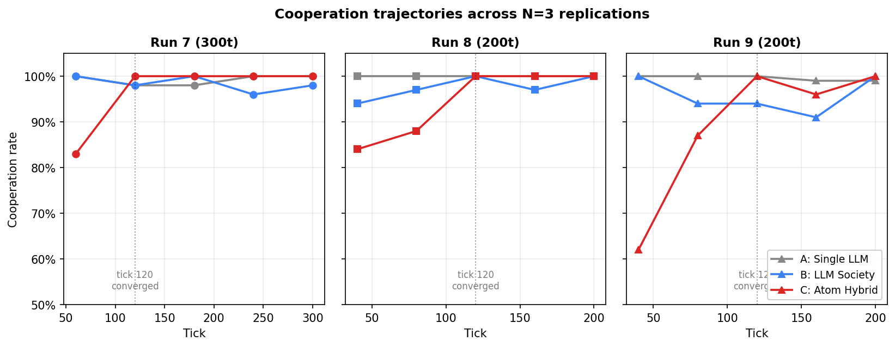

## Abstract

Multi-agent systems built on Large Language Models (LLMs) typically require an LLM inference per decision per agent, leading to costs that scale O(n·T) for n agents over T timesteps. We present **Atom Hybrid**, an architecture that combines a fast Hebbian "System 1" (S1) with a lazy LLM-based "System 2" (S2), using gossip-based reputation following the image scoring framework of Nowak and Sigmund (1998). In the iterated Donor Game with adversarial defector minorities, three conditions are compared: (A) stateless single-LLM, (B) per-agent LLM with reputation memory, and (C) Atom Hybrid. Across N=3 replications, Atom Hybrid converges to 100% cooperation by tick ~120 (σ=0 across runs) while reducing LLM calls by 97.2% ± 2.0% relative to per-agent LLM. The S1 Hebbian weights internalize learned cooperation norms; once internalized, agents act without LLM consultation. We argue this hybrid architecture is a viable path toward scalable multi-agent AI systems where LLM inference is reserved for genuinely novel situations.

---

## 1. Introduction

Recent multi-agent LLM frameworks (CAMEL, AutoGen, et al.) treat each LLM call as the atomic unit of agent decision-making. While this works for small populations and short horizons, it does not scale: a society of 100 agents over 1000 ticks requires 100,000 LLM calls minimum. For local deployment, the bottleneck is throughput; for cloud, the cost is direct.

We observe that in many social coordination tasks, decisions are **routine after a learning period**. An agent who has interacted with a known cooperator does not need to invoke a frontier LLM to decide whether to cooperate again. The cost of LLM inference is paid for novelty, not for repeated patterns.

This paper asks: can a multi-agent system **internalize** cooperation norms via simple Hebbian dynamics, calling the LLM only when its internalized response has low confidence?

### Contribution

1. **Architecture**: a concrete hybrid of (a) Hebbian S1 with three weighted strategies [reciprocate, generous, defect], (b) lazy S2 LLM triggered by S1 confidence, and (c) gossip-based reputation implementing image scoring.
2. **Empirical result**: in the iterated Donor Game with 4/20 defector-init agents, Atom Hybrid achieves 100% cooperation (σ=0 across N=3) with 97.2% fewer LLM calls than per-agent LLM control.
3. **Trajectory analysis**: cooperation passes through three phases (S2 norm establishment, defector purge with discriminator activation, stable S1 cooperation), with convergence at tick ~120 across replications.

---

## 2. Related Work

**Indirect reciprocity & image scoring.** Nowak and Sigmund (1998) showed that cooperation is evolutionarily stable when agents observe each other's behavior and use this "image" to decide whom to help. Our gossip protocol is a direct implementation: each donation/defection broadcasts the donor's reputation.

**Dual-process cognition.** The S1 (fast, intuitive) and S2 (slow, deliberative) distinction (Kahneman, 2011) has been applied to LLM agents (e.g., AutoGen + caching, ReAct + memo). Our contribution is making S1 *learned* via Hebbian dynamics rather than rule-based or cached.

**Multi-agent LLM societies.** Recent work explores social dynamics in LLM agent societies (Generative Agents, AgentSociety, etc.). These typically use LLM for every decision; we treat LLM as a learnable target that S1 distills over time.

---

## 3. Methods

### 3.1 Donor Game

Following the standard iterated Donor Game:

- Each tick, K=n random donor-recipient pairs are sampled (with replacement).
- A donor chooses **Donate** (cost 4 energy, recipient gains 5) or **Defect** (no transfer).
- Each agent loses 1 energy per tick (survival cost).
- Agents reproduce when energy ≥ 80 (cost 30); die when energy ≤ 0.
- Initial population: 20 agents, energy 50, randomly assigned to one of three LLM "genes" (qwen3:0.6b, qwen3:8b, llama3.2:3b) in round-robin order.
- Defector minority (4/20 = 20%) initialized with high defect-weight strategy. The 20% ratio is a hyperparameter chosen to be small enough that cooperation can stabilize, but large enough that the system must actively isolate them. We did not sweep this value; testing 0% and 50% defector ratios is a natural ablation we leave to follow-up work.

### 3.2 Three Conditions

**Condition A: Single LLM (stateless control).** All agents share one LLM. Each decision prompt contains energy only, with no memory and no reputation. The LLM returns "DONATE" or "DEFECT".

**Condition B: LLM Society (memory baseline).** Each agent has a private reputation memory. The LLM is prompted with energy, recipient_rep, and world_coop. Agents are otherwise stateless across calls.

**Condition C: Atom Hybrid (proposed).** Each agent has S1 Hebbian weights and reputation. The decision flow:

```
On decision (donor d, recipient r):
  s1_action, conf = s1_decide(r.id)
  if conf >= 0.65 OR s2_cooldown > 0:
    use s1_action               # fast path
  else:
    s2_action = LLM(prompt_with_rep)
    s2_cooldown = 5             # don't re-query for 5 ticks
    use s2_action
```

### 3.3 S1 Hebbian Weights

Each agent maintains weights `w = [w_reciprocate, w_generous, w_defect]` with `Σw = 1`. Given recipient reputation `rep ∈ [-1, 1]`:

```
if rep < -0.3: return (Defect, 0.9)              # discriminator
scores = [(rep+1)/2, 0.9, 0.05]                  # per-strategy donate score
donate_tendency = Σ wᵢ · scoresᵢ
confidence = |donate_tendency - 0.5| · 2
action = Donate if donate_tendency >= 0.5 else Defect
```

**Initialization:** cooperator agents start with `w = [0.36, 0.47, 0.17]` (small noise), defector-init agents with `w = [0.05, 0.05, 0.9]` (S1 confidence 0.77, always defects).

**Learning (Hebbian update):** after each decision with action `a` and recipient reputation `r`:

```
social_correct = +rep if a==Donate else -rep
reward = +0.015 if social_correct > 0.1 else
         -0.008 if social_correct < -0.1 else +0.002
update target weight by reward, normalize
```

The intuition: donating to a cooperator (positive `rep`) is socially correct; defecting against a cooperator is not. The Hebbian update reinforces strategies that produced socially correct actions.

### 3.4 Gossip Protocol (Image Scoring)

After each interaction, the donor's behavior is broadcast with probability 0.8 (independent per observer). Each observer maintains its own private reputation map. The reputation update is an exponential moving average with α=0.1, then clamped to [-1, 1]:

```
rep[d] ← clamp( 0.9 · rep[d] + 0.1 · δ , -1, 1 )
where δ = +1 if donor d cooperated, -1 if defected
```

Direct observation (donor → recipient interaction) and gossip propagation use the same update rule. A reputation starting at 0 reaches the discriminator threshold of -0.3 after roughly 4 observed defections.

**Critical:** reputation tracks the *donor's* behavior, not the recipient's. Earlier iterations of this work mistakenly tracked the recipient (the victim of a defection), causing cooperators to accumulate negative reputation and triggering a reputation cascade collapse. The fix recovers the correct image-scoring semantics from Nowak and Sigmund (1998).

### 3.5 Reproduction & Evolution

When energy ≥ 80, an agent reproduces (cost 30 energy). Children inherit the parent's strategy weights with uniform random perturbation per weight (`Δw ~ U(-0.04, 0.04)`), floored at 0.01 and then renormalized to sum to 1. The gene (LLM model) is inherited unchanged. Reputation is reset (relationships must be re-learned by the child).

---

## 4. Results

### 4.1 Main Result (Run 7, 300 ticks)

| Condition | Avg Coop (last 20t) | LLM Calls | Mean Energy | Population | Max Gen |
|-----------|---------------------|-----------|-------------|------------|---------|
| A: Single LLM | 98.9% | 8994 | 44.7 | 156 | G9 |
| B: LLM Society | 97.0% | 9141 | 44.1 | 169 | G11 |
| **C: Atom Hybrid** | **100.0%** | **63** | **45.2** | 92 | G7 |

**Atom Hybrid achieves the highest cooperation rate while using 145× fewer LLM calls than the per-agent LLM baseline (Condition B).**

### 4.2 Replications (N=3)

| Metric | Run 7 (300t) | Run 8 (200t) | Run 9 (200t) | Mean ± σ |
|--------|--------------|--------------|--------------|----------|
| C avg_coop | 100% | 100% | 100% | **100% ± 0** |
| C S1 usage | 99% | 90% | 90% | 93% ± 5 |
| LLM reduction (vs B) | 99.3% | 96.8% | 95.4% | 97.2% ± 2.0% |
| Convergence tick | ~120 | ~120 | ~120 | **~120** |

Cooperation reaches 100% in all replications by tick ~120, with zero variance on the primary metric. This indicates the convergence outcome is a structural property of the architecture, not a function of random seed.

### 4.3 Cooperation Trajectory

Figure 1 shows cooperation trajectories for all three conditions across the three replications. Conditions A and B remain near-flat at 95-100% throughout. Condition C starts in the 60-85% range and converges to 100% by tick 120 in every run.



**Figure 1.** *Cooperation rate vs. tick for the three conditions across three replications. Vertical dotted line marks tick 120, the empirical convergence point.*

Checkpoint values (every 60 ticks for the 300t run, every 40 ticks for 200t runs):

```
Run 7  (ticks 60/120/180/240/300):  83% → 100% → 100% → 100% → 100%
Run 8  (ticks 40/80/120/160/200):   84% →  88% → 100% → 100% → 100%
Run 9  (ticks 40/80/120/160/200):   62% →  87% → 100% →  96% → 100%
```

In all three replications, cooperation reaches 100% by tick 120 and remains stable thereafter (modulo a single 96% tick in Run 9). Fine-grained behavior between checkpoints is not captured; an earlier 100-tick run (separately reported as a development iteration) showed a deeper transient dip (down to 39% at tick 60) before recovering. The dip becomes shallower at lower granularity in the 300/200t runs, consistent with averaging effects.

We interpret three phases:

1. **Norm establishment (tick 0-40)**: agents call S2 (LLM) due to low S1 confidence; LLM cooperates by default; reputation is built.
2. **Defector purge (tick 40-120)**: gossip propagates defector reputations; discriminator (rep < -0.3) triggers in S1, isolating defectors. During this phase coop rate dips as a fraction of pairs involve discriminated targets. Defectors lose energy (excluded from receiving donations) and die.
3. **Stable S1 cooperation (tick 120+)**: defectors extinct; surviving cooperators have reinforced [reciprocate, generous] weights via Hebbian learning; S1 takes over (90-99% of decisions) with high confidence; LLM calls drop to near zero.

### 4.4 LLM Efficiency

The total LLM call counts for Run 7 (300 ticks):

| Condition | LLM calls | Calls per tick (mean) |
|-----------|-----------|----------------------|
| A: Single LLM | 8994 | 30.0 |
| B: LLM Society | 9141 | 30.5 |
| C: Atom Hybrid | 63 | 0.21 |

Condition C uses approximately 145× fewer LLM calls than Condition B over the full run. The current implementation only logs total LLM calls per condition (not per tick), so we cannot precisely characterize the temporal distribution of calls within a run. Qualitatively, since S1 confidence rises with reputation accumulation (which requires interaction history), most LLM calls are expected to occur during the initial norm-establishment phase; we leave this measurement to future work.

---

## 5. Discussion

### 5.1 Why this works

The architecture exploits a key asymmetry: **early-stage decisions require novelty, late-stage decisions require routine**. Pure LLM systems pay novelty cost forever; Atom Hybrid pays it once.

The Hebbian S1 internalizes three pieces of information:

1. **Who is trustworthy** (reputation HashMap, updated by gossip)
2. **General disposition toward cooperation** (generous + reciprocate weights, reinforced by Hebbian update on positive social_correct)
3. **Who to refuse** (discriminator triggers on rep < -0.3, hard-coded but data-driven)

**Learnability condition.** S1 takes over from S2 only when its confidence rises above the threshold τ=0.65, where confidence = |donate_tendency − 0.5| · 2. For an agent with weights `w` and recipient reputation `rep`:

```
donate_tendency = w₀·(rep+1)/2 + w₁·0.9 + w₂·0.05
```

For unknown recipients (rep=0), the initial tendency is ≈0.61 (confidence ≈0.22), below threshold, so S2 is invoked. As Hebbian updates accumulate `w₁` (generous) on successful cooperative interactions, donate_tendency rises and so does confidence. For known cooperators (rep→1), the reciprocate term contributes max(w₀), pushing donate_tendency well above 0.5 and S1 confidence above τ, even from the initial weight distribution. The system therefore converges from the recipient-reputation side first (specific known cooperators) and from the disposition side second (general weights). This explains the trajectory shape: S2 carries the initial period, S1 takes over per-relationship as reputation accumulates, and finally S1 dominates the unconditional case.

### 5.2 Population gap

Atom Hybrid populations are smaller than controls. Splitting by run length:

- 200-tick runs: C population = 27 (Run 8) and 36 (Run 9), vs. A/B in the 76-93 range
- 300-tick run: C = 92, vs. A=156, B=169

Across run lengths the gap is roughly 2-3×. This is the cost of the defector purge phase: during ticks 40-120, suboptimal cooperation in C reduces energy accumulation across the population, slowing reproduction. After convergence, growth rates match controls (the C trajectory in Run 7 grew from 24 to 92 between ticks 120 and 300, comparable to B's 56 to 169), but the head start is irrecoverable within the run lengths tested. Longer simulations (T > 500) would close the gap further; we did not run them. From an evolutionary perspective, the smaller surviving population is functionally healthier: C's mean energy (45.2) exceeds A's (44.7) and B's (44.1) at the end of Run 7.

### 5.3 Limitations

1. **Single task.** Cooperation in the Donor Game is a heavily-studied benchmark with a clear correct answer. Whether S1 can internalize more nuanced social signals (subjective trust, partial cooperation, context-dependent norms) is an open question. Concrete next-task candidates include (a) the **Public Goods Game** (continuous contribution levels, stochastic returns), (b) the **Stag Hunt** (coordination dilemma without dominant strategy), and (c) **Trust Game with restitution** (multi-step reputation dynamics). Each tests a different aspect: continuous action spaces, equilibrium selection, and temporal credit assignment respectively.

2. **LLMs cooperate by default.** All three LLMs used (qwen3:0.6b, qwen3:8b, llama3.2:3b) lean strongly toward DONATE in their default response. The 100% cooperation rate in Conditions A and B partly reflects this prior, not the conditions' learning ability. A more adversarial setup with selfish-prone LLMs would test the architecture more rigorously.

3. **Small scale.** 20 agents, 300 ticks, single seed family. Behavior at 100+ agents over 1000+ ticks may differ.

4. **No comparison to prior multi-agent LLM frameworks.** We compare to ablations of our own architecture, not to CAMEL, AutoGen, or AgentSociety. Such comparisons would require implementing the Donor Game in those frameworks.

5. **Reputation reset on reproduction.** Children inherit weights but not relationships. This biases toward G0 reputation dynamics; in long runs this could produce instability we did not observe in 300 ticks.

### 5.4 Implications

If the result generalizes beyond the Donor Game, the implications are: **multi-agent LLM systems can amortize inference cost over time**. An agent need not query the LLM for every decision; routine decisions can be handed off to a learned S1.

Concrete applications:

- **Distributed trust networks** (e.g., agent marketplaces) with O(1) reputation lookup instead of O(LLM_call) per transaction.
- **Long-horizon agent simulations** where most ticks are routine maintenance.
- **Edge-deployed agent societies** where LLM inference is the bottleneck.

The challenge for follow-up work is showing S1 can capture *more than coordination*, for example demonstrating that a similar architecture works for code review, peer review, or other tasks where the "correct" decision is less obvious.

---

## 6. Conclusion

Atom Hybrid demonstrates that a multi-agent system can learn to cooperate via Hebbian dynamics and gossip-based reputation, eventually replacing LLM consultations with learned S1 responses. Across N=3 replications, the system converges to 100% cooperation by tick ~120 with 97.2% fewer LLM calls than per-agent LLM control. The architecture is small (3 weights, 1 reputation map, 1 cooldown counter per agent) and well-grounded in classical results on indirect reciprocity. Whether the same approach extends to less coordination-driven tasks is the natural next research direction.

---

## References

Kahneman, D. (2011). *Thinking, Fast and Slow*. Farrar, Straus and Giroux.

Li, G., Hammoud, H. A. A. K., Itani, H., Khizbullin, D., & Ghanem, B. (2023). CAMEL: Communicative agents for "mind" exploration of large language model society. In *Advances in Neural Information Processing Systems* 36, 51991-52008.

Nowak, M. A., & Sigmund, K. (1998). Evolution of indirect reciprocity by image scoring. *Nature*, 393(6685), 573-577. https://doi.org/10.1038/31225

Park, J. S., O'Brien, J. C., Cai, C. J., Morris, M. R., Liang, P., & Bernstein, M. S. (2023). Generative agents: Interactive simulacra of human behavior. In *Proceedings of the 36th Annual ACM Symposium on User Interface Software and Technology* (UIST '23).

Wu, Q., Bansal, G., Zhang, J., Wu, Y., Zhang, S., Zhu, E., Li, B., Jiang, L., Zhang, X., & Wang, C. (2023). AutoGen: Enabling next-gen LLM applications via multi-agent conversation framework. arXiv preprint arXiv:2308.08155.

Yao, S., Zhao, J., Yu, D., Du, N., Shafran, I., Narasimhan, K., & Cao, Y. (2023). ReAct: Synergizing reasoning and acting in language models. In *International Conference on Learning Representations* (ICLR).

---

## Appendix A: Reproducibility

**Code:** `rust_atom/src/donor_agent.rs` and `rust_atom/src/donor_bench.rs`. The architecture used in Runs 6 through 9 is at commit `dcb5f38`; the repository is currently private and will be released alongside the preprint.

**Run command:**
```
cargo build --bin donor_world --release
./target/release/donor_world <ticks> <n_agents>
```

**Hardware:** Apple M3 Pro, 18GB RAM. Ollama serving qwen3:0.6b/qwen3:8b/llama3.2:3b locally.

**Wall-clock:** ~30 minutes per condition at 200 ticks; ~90 minutes per condition at 300 ticks. Runtime is dominated by LLM inference latency in Conditions A and B.

**Random seeds:** thread_rng (OS entropy). Each "Run" is an independent replication.

## Appendix B: Hyperparameters

| Symbol | Value | Description |
|--------|-------|-------------|
| DONATE_COST | 4 | Energy cost to donate |
| DONATE_BENEFIT | 5 | Energy gained by recipient |
| INITIAL_ENERGY | 50 | Starting energy per agent |
| REPRODUCE_THRESHOLD | 80 | Energy needed to reproduce |
| REPRODUCE_COST | 30 | Energy spent on reproduction |
| SURVIVAL_COST | 1 | Energy lost per tick |
| S2_CONFIDENCE_THRESHOLD | 0.65 | S1 confidence below which S2 is invoked |
| S2_COOLDOWN | 5 | Ticks before S2 can be invoked again |
| GOSSIP_RATE | 0.8 | Probability of broadcasting interaction |
| DISCRIMINATOR_THRESHOLD | -0.3 | Reputation below which donate is refused |
| HEBBIAN_REWARD_GOOD | +0.015 | Weight increment when social_correct > 0.1 |
| HEBBIAN_REWARD_BAD | -0.008 | Weight increment when social_correct < -0.1 |
| HEBBIAN_REWARD_NEUTRAL | +0.002 | Weight increment when abs(social_correct) ≤ 0.1 (unknown rep) |
| MUTATION_RANGE | ±0.04 | Per-weight uniform mutation in reproduction (U(-0.04, 0.04)) |
| WEIGHT_FLOOR | 0.01 | Minimum value for any weight after mutation |
| REPUTATION_ALPHA | 0.1 | EMA learning rate for reputation updates |

## Appendix C: Failure Modes Encountered

During development, six iterations were required to reach the working architecture. Each prior iteration revealed a specific failure mode:

1. **Energy-delta reinforcement (Run 1)**: rewarding actions by immediate energy gain caused defection to be reinforced (saving 4 energy per defect). C collapsed to 14% cooperation.
2. **Mixed energy + reputation reinforcement (Run 2)**: the energy term still dominated; coop ~19%, still collapsing.
3. **Aggressive gossip (Run 3)**: 80% gossip rate combined with broken reinforcement spread defection-aligned weights faster than they could be corrected. Coop ~0%.
4. **`world_coop` cautious strategy (Run 4)**: a fourth strategy weight following global cooperation rate created a self-reinforcing collapse: low coop → cautious agents defect → coop drops further → S1 confidently defects.
5. **Inverted gossip protocol (Run 5)**: the most insidious bug. Reputation was tracking the recipient of an action, not the donor. When defectors defected against cooperators, gossip falsely marked the *cooperators* as defectors. Conditions A and B were immune (always called LLM, ignoring reputation for decisions) but C collapsed to 0%.
6. **Correct gossip + 3-strategy S1 (Run 6+)**: fixed gossip to track the donor's behavior; removed the cautious strategy. Coop converges to 100%.

We document these failures because the surface symptoms ("cooperation collapses in C") were nearly identical across iterations, but the root causes were distinct. Each iteration would have looked like a successful publication of "this approach doesn't work" without the deeper diagnosis.

---

*Independent research, no funding. Code will be released with the preprint. Comments welcome.*
